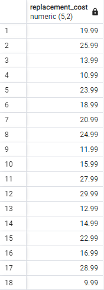
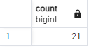

1. SELECT DISTINCT replacement_cost FROM film;

   

2. SELECT COUNT(DISTINCT replacement_cost) FROM film;

   

3. SELECT COUNT(*) FROM film
   WHERE (title LIKE 'T%') AND (rating IN ('G'));

   

4. SELECT COUNT(*) FROM country
   WHERE country LIKE '_ _ _ _ _';

   

5. SELECT COUNT(*) FROM city
   WHERE city ILIKE '%R';

   
